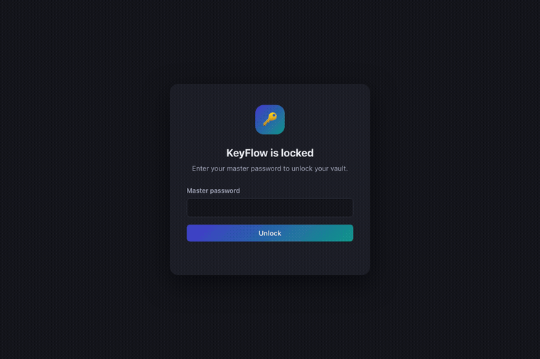

<p align="center">
  
</p>

<h1 align="center">KeyFlow</h1>
<p align="center">A native-feeling credential autofill assistant and password manager — local-first, open source.</p>

<p align="center">
  
</p>
<p align="center"><sub>UI walkthrough with sample data, captured from the app's real frontend code via its <a href="apps/desktop/dev-preview.html">dev preview harness</a> (see <a href="CONTRIBUTING.md">CONTRIBUTING.md</a>) — not a recording of the compiled native window.</sub></p>

---

## What this is

KeyFlow recognizes login forms and suggests the right saved username,
email, or password exactly when you need it — the experience Apple's
Password AutoFill popularized, built as an original, cross-platform,
open-source product for macOS, Windows, and Linux.

It is **not** a website wrapped in a desktop shell. The UI is a real
native window (Tauri: your OS's own webview, not a bundled Chromium);
the vault engine is a dependency-light Rust core with no networking and
`unsafe_code = "forbid"`.

## Where this release actually stands

This is an early, honest **v0.1**. The desktop app — vault, encryption,
password generator, security dashboard, and the phishing-resistant
domain-matching engine — is real, working, and unit-tested today, and
was manually clicked through on macOS, and now also builds and packages
successfully on real Windows and Linux GitHub Actions runners via CI
(installers for all three are on the
[v0.1.0 release](https://github.com/L1avZh/KeyFlow/releases/tag/v0.1.0))
— though only macOS has had a human actually run the built app and
click through its screens; Windows/Linux are "compiles and packages
cleanly," not yet "someone confirmed the UI works there." The **browser
extension is architecture only** — not implemented yet. See [ROADMAP.md](ROADMAP.md)
for the honest gap list before treating this as a daily-driver
replacement for your current password manager.

## Features (this release)

- **Encrypted local vault** — AES-256-GCM + Argon2id, atomic crash-safe
  writes. See [SECURITY.md](SECURITY.md).
- **Password & passphrase generator** with a live, honestly-computed
  entropy estimate (no "unhackable" claims).
- **Security dashboard** — weak, reused, old, and duplicate passwords,
  computed entirely on-device from your already-unlocked vault. No
  password or hash is ever sent anywhere to check this.
- **Phishing-resistant domain matching** — a credential saved for
  `example.com` is offered on `login.example.com`, but never on
  `example.com.attacker.com` or `attacker-example.com`. Handles
  HTTP→HTTPS transitions, IP literals, localhost/`*.test` dev domains,
  and IDNA/punycode normalization. Try it yourself in-app under
  **Security → Autofill Tester**.
- **Command palette** (⌘⇧K / Ctrl⇧K) — search credentials, copy a
  username/password, jump anywhere, or lock the vault, without touching
  the mouse.
- **CSV import** with a review screen (duplicate/weak/missing-URL
  detection before anything is committed) and plaintext JSON export
  (with an explicit warning — exported files are not encrypted).
- **Optional quick unlock** via your OS's own secure storage (Keychain /
  Credential Manager / Secret Service) — off by default, disclosed
  trade-off, see [SECURITY.md](SECURITY.md).
- Auto-lock on inactivity, manual lock, clipboard auto-clear after
  copying a secret.

## Supported platforms

| Platform | Status |
|---|---|
| macOS (Apple Silicon) | Built, run, and manually clicked through this release |
| Windows x64 | Builds and packages successfully via CI on a real Windows runner ([installer download](https://github.com/L1avZh/KeyFlow/releases/tag/v0.1.0)) — not yet manually smoke-tested by a human on Windows |
| Linux x64 | Builds and packages successfully via CI on a real Ubuntu runner ([AppImage/deb/rpm download](https://github.com/L1avZh/KeyFlow/releases/tag/v0.1.0)) — not yet manually smoke-tested by a human on Linux |
| Linux ARM64 | Not yet attempted |
| Browser extension (Chrome/Edge/Firefox/Safari) | Architecture documented ([ARCHITECTURE.md](ARCHITECTURE.md) §4), not implemented |

All release binaries are **unsigned** (see the [release notes](https://github.com/L1avZh/KeyFlow/releases/tag/v0.1.0) for what that means when installing).

## Security & privacy at a glance

Local-first, no account required, no telemetry, no network requests made
by this app in this release. Full detail in [SECURITY.md](SECURITY.md),
[PRIVACY.md](PRIVACY.md), and [THREAT_MODEL.md](THREAT_MODEL.md) — the
threat model in particular is written to say plainly what KeyFlow does
**not** protect against, not just what it does.

## Installation

No packaged releases have been cut yet (see ROADMAP.md — installers,
Homebrew, AppImage/deb/rpm are planned, not done). For now, build from
source:

```bash
git clone https://github.com/L1avZh/KeyFlow.git
cd KeyFlow
```

### Prerequisites

- [Rust](https://rustup.rs/) (stable toolchain)
- [Node.js](https://nodejs.org/) 20+ and npm
- Platform build tools: Xcode Command Line Tools (macOS), the
  [Tauri prerequisites](https://tauri.app/start/prerequisites/) for
  Windows/Linux (WebView2 runtime on Windows; `webkit2gtk` and friends on
  Linux)

### Run in development

```bash
cd apps/desktop
npm install
cargo tauri dev
```

### Build a release binary for your current platform

```bash
cd apps/desktop
npm install
cargo tauri build
```

Output lands in `apps/desktop/src-tauri/target/release/bundle/`.

### Run the test suite

```bash
cargo test --workspace
```

## Repository layout

```
crates/keyflow-core/   Vault, crypto, domain matching, password generator — pure Rust, no UI.
apps/desktop/          Tauri desktop app (Rust backend + vanilla TypeScript frontend).
browser-extension/     Architecture notes for the not-yet-built browser extension.
```

See [ARCHITECTURE.md](ARCHITECTURE.md) for the full design and technology
rationale.

## Development

`apps/desktop/dev-preview.html` is a dev-only harness that mocks the
Tauri IPC layer so the UI can be iterated on in a plain browser tab
without a native build — see [CONTRIBUTING.md](CONTRIBUTING.md).

## Contributing

See [CONTRIBUTING.md](CONTRIBUTING.md). Please read
[SECURITY.md](SECURITY.md) before reporting a vulnerability — not as a
GitHub issue.

## Roadmap

See [ROADMAP.md](ROADMAP.md) for what's next, in priority order — the
browser extension and packaged installers are the two biggest gaps.

## License

[MIT](LICENSE).
